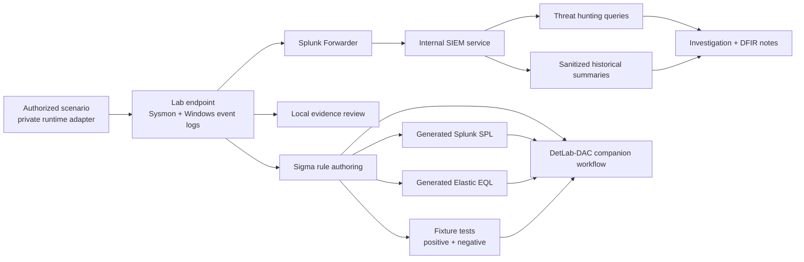

# cybersecurity-playbook

[](https://github.com/egrexsec/cybersecurity-playbook/actions/workflows/detection-validation.yml)

A **purple-team and detection-engineering repository** that turns controlled simulations into tested Sigma rules, generated platform queries, threat-hunting artifacts, IR workflow components, and sanitized historical validation summaries.

Designed to showcase **evidence-backed security engineering skills** through repeatable validation, artifact traceability, and public-safe technical depth.

## Explore

- [Validation status](#current-validation-status)
- [What this repository is](#what-this-repository-is)
- [Detection lifecycle](#detection-lifecycle)
- [Repository map](#repository-map)
- [Quick-start validation](#quick-start-validation)
- [Current capabilities](#current-capabilities)
- [Current limitations](#current-limitations)
- [Case study](#case-study)
- [What this project demonstrates](#what-this-project-demonstrates)
- [Additional repository documentation](#additional-repository-documentation)

## Current validation status

| Scenario | ATT&CK technique | Behavior | Detection format | Validation status |
|---|---|---|---|---|
| PT-2026-001 | T1059.001 | PowerShell decode-and-execute | Sigma + SPL/EQL | **Fixture tested; historical live summary dated 2026-07-18** |
| PT-2026-002 | T1059.003 | Windows command shell execution | Sigma + SPL/EQL | **Fixture tested; historical live summary dated 2026-07-18** |
| PT-2026-003 | T1047 | WMI-backed process execution | Sigma + SPL/EQL | **Fixture tested; historical live summary dated 2026-07-18** |
| PT-2026-004 | T1053.005 | Scheduled task creation | Sigma + SPL/EQL | **Fixture tested; historical live summary dated 2026-07-18** |
| PT-2026-005 | T1543.003 | Windows service creation | Sigma + SPL/EQL | **Fixture tested; historical live summary dated 2026-07-18** |
| PT-2026-006 | T1547.001 | Registry run key persistence | Sigma + SPL/EQL | **Fixture tested; historical live summary dated 2026-07-18** |
| PT-2026-007 | T1037.001 | Logon script registry persistence | Sigma + SPL/EQL | **Fixture tested; historical live summary dated 2026-07-18** |
| PT-2026-008 | T1197 | BITS job creation | Sigma + SPL/EQL | **Fixture tested; historical live summary dated 2026-07-18** |
| PT-2026-009 | T1546.013 | PowerShell profile persistence | Sigma + SPL/EQL | **Fixture tested; historical live summary dated 2026-07-18** |
| PT-2026-010 | T1218.011 | Rundll32 proxy execution | Sigma + SPL/EQL | **Fixture tested; historical live summary dated 2026-07-18** |
| PT-2026-011 | T1218.010 | Regsvr32 proxy execution | Sigma + SPL/EQL | **Fixture tested; historical live summary dated 2026-07-18** |

**Meaning of statuses in this repo**
- **Historical live summary**: a sanitized record says an authorized live replay previously completed. It is not proof of current lab, telemetry, or deployment health.
- **Fixture tested**: validated offline against sanitized positive/negative fixtures only.
- **Conversion supported**: Sigma successfully converts to a backend target, but no live backend validation exists yet.
- **Planned / partially ready**: documented or scaffolded, but not yet validated to the same standard.

## What this repository is

This repository is the **content and evidence companion** to **DetLab-DAC**.

- `cybersecurity-playbook` stores the reusable authored content: scenarios, Sigma rules, generated queries, fixtures, hunts, investigations, and validation records.
- **DetLab-DAC** is the companion platform/workflow that can consume, display, or operationalize this content.

This repository is **not** a standalone SIEM product, not a production detection deployment framework, and not a replacement for environment-specific engineering review.

## Detection lifecycle

The current implemented workflow is:

1. author a scenario and safety contract
2. prepare sanitized positive and negative fixtures
3. develop canonical Sigma logic
4. run offline fixture tests
5. generate Splunk and Elastic queries
6. produce hunt, IR, and validation-summary artifacts
7. optionally run a separately authorized live adapter after private preflight
8. publish only sanitized summaries; keep raw evidence in external DFIR storage



## Repository map

| Path | Purpose | Content type | Validation model |
|---|---|---|---|
| `purple-team/scenarios/` | Canonical purple-team scenario definitions | Human-authored YAML + notes | Schema validation + fixture and historical-summary references |
| `detections/sigma/` | Canonical authored Sigma rules | Human-authored YAML | Sigma lint + conversion + fixtures |
| `detections/generated/` | Backend-specific generated output | Generated SPL/EQL | Regenerated from canonical Sigma; do not edit by hand |
| `detections/validation/live/` | Sanitized historical validation summaries | Generated JSON metadata | Schema checked; not current-health evidence |
| `detections/validation/` | Human-readable validation summaries | Human-authored Markdown | Linked to fixtures and live validation JSON |
| `tests/fixtures/` | Positive/negative rule fixtures | Sanitized JSON fixtures | Offline fixture test harness |
| `automation/` | Validation and orchestration tooling | Python + PowerShell | Repo-side command execution and content validation |
| `docs/current-state/` | Program status, readiness boundaries, timeline, portfolio metrics | Human-authored Markdown | Repository evidence plus clearly dated historical observations |
| `docs/detection-engineering/` | Detection engineering implementation notes | Human-authored Markdown | Documentation-only |
| `docs/data-sources/` | Source-system and field-mapping notes | Human-authored Markdown | Documentation-only |
| `templates/` | Authoring templates for detections, hunts, investigations | Human-authored Markdown templates | Manual review + template consistency checks |
| `case-studies/` | End-to-end, skills-forward technical walk-throughs | Human-authored Markdown | Sourced from validated scenarios only |

## Quick-start validation

These commands currently work from the repository root:

```bash
python3 playbook validate
python3 playbook --json sigma lint
python3 playbook --json sigma convert --target all
python3 playbook --json test fixtures
python3 playbook --json validate previous-scenarios
python3 playbook --json status
python3 playbook --json timeline
python3 playbook --json metrics
python3 automation/validators/check_markdown.py
python3 automation/validators/public_safety.py
python3 -m unittest discover -s tests -p 'test_*.py' -v
```

## Current capabilities

Implemented today:
- schema validation for scenarios and hunt hypotheses
- Sigma metadata linting
- Sigma conversion to Splunk and Elastic outputs
- positive and negative fixture testing
- sanitized historical validation-summary parsing
- deterministic, duplicate-aware IR intake and fixture-backed workflow tests
- approval-gated external live-adapter contract; embedded live executors are disabled
- generated Splunk SPL and generated Elastic EQL separation
- GitHub Actions validation workflow
- secret scanning in CI
- public-safe evidence handling and sanitized repo artifacts

## Current limitations

Be explicit about current limits:
- Elastic conversion exists, but **no live Elastic backend is deployed or validated**
- historical Splunk results relied on **raw XML matching** in places where normalized fields/CIM remain incomplete
- durable Splunk saved searches / alerts are **not yet verified as deployed objects**
- no current live environment health or deployment state is asserted by this repository
- broader DFIR, cloud, network, and memory-forensics coverage remains incomplete
- this repository is **not** a production deployment platform

## Case study

Start with the end-to-end PowerShell case study:
- [PowerShell Encoded Command Case Study](case-studies/powershell-encoded-command/README.md)

## What this project demonstrates

This repository demonstrates evidence-backed security engineering skills in:
- detection engineering
- purple-team validation
- threat hunting
- SIEM investigation
- ATT&CK mapping
- Python automation
- CI/CD for security content
- fixture-driven rule testing
- technical writing and evidence handling

## Additional repository documentation

- [Roadmap](ROADMAP.md)
- [Contributing](CONTRIBUTING.md)
- [Security policy](SECURITY.md)
- [Current program status](docs/current-state/PURPLE_TEAM_PROGRAM_STATUS.md)
- [Portfolio metrics](docs/current-state/PORTFOLIO_METRICS.md)
