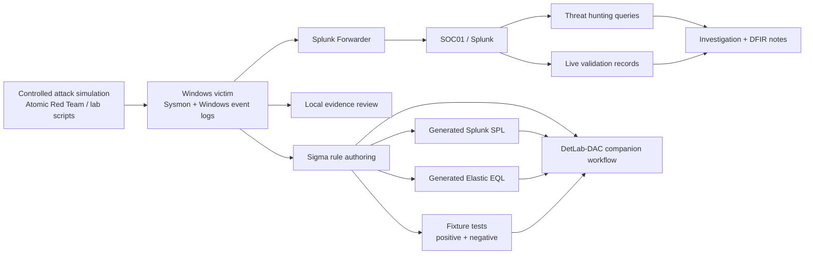

# cybersecurity-playbook

[](https://github.com/egrexsec/cybersecurity-playbook/actions/workflows/detection-validation.yml)

A **lab-validated purple-team and detection-engineering repository** that turns controlled attack simulations into tested Sigma rules, platform-specific queries, threat-hunting artifacts, investigation documentation, and reusable validation evidence.

Designed to showcase **evidence-backed security engineering skills** through repeatable validation, artifact traceability, and public-safe technical depth.

## Explore

- [Validation status](#current-validation-status)
- [What this repository is](#what-this-repository-is)
- [Detection lifecycle](#detection-lifecycle)
- [Repository map](#repository-map)
- [Quick-start validation](#quick-start-validation)
- [Current capabilities](#current-capabilities)
- [Current limitations](#current-limitations)
- [Case study](#case-study)
- [What this project demonstrates](#what-this-project-demonstrates)
- [Additional repository documentation](#additional-repository-documentation)

## Current validation status

| Scenario | ATT&CK technique | Behavior | Detection format | Validation status |
|---|---|---|---|---|
| PT-2026-001 | T1059.001 | PowerShell decode-and-execute | Sigma + Splunk/Wazuh evidence | **Live validated** |
| PT-2026-002 | T1059.003 | Windows command shell execution | Sigma + Splunk/Wazuh evidence | **Live validated** |
| PT-2026-003 | T1047 | WMI-backed process execution | Sigma + Splunk/Wazuh evidence | **Live validated** |
| PT-2026-004 | T1053.005 | Scheduled task creation | Sigma + Splunk evidence | **Live validated** |
| PT-2026-005 | T1543.003 | Windows service creation | Sigma + Splunk evidence | **Live validated** |
| PT-2026-006 | T1547.001 | Registry run key persistence | Sigma + Splunk evidence | **Live validated** |
| PT-2026-007 | T1037.001 | Logon script registry persistence | Sigma + Splunk evidence | **Live validated** |
| PT-2026-008 | T1197 | BITS job creation | Sigma + Splunk evidence | **Live validated** |
| PT-2026-009 | T1546.013 | PowerShell profile persistence | Sigma + Splunk evidence | **Live validated** |
| PT-2026-010 | T1218.011 | Rundll32 proxy execution | Sigma + Splunk evidence | **Live validated** |
| PT-2026-011 | T1218.010 | Regsvr32 proxy execution | Sigma + Splunk evidence | **Live validated** |

**Meaning of statuses in this repo**
- **Live validated**: replayed in the Mayuri lab with positive/negative evidence and cleanup confirmation.
- **Fixture tested**: validated offline against sanitized positive/negative fixtures only.
- **Conversion supported**: Sigma successfully converts to a backend target, but no live backend validation exists yet.
- **Planned / partially ready**: documented or scaffolded, but not yet validated to the same standard.

## What this repository is

This repository is the **content and evidence companion** to **DetLab-DAC**.

- `cybersecurity-playbook` stores the reusable authored content: scenarios, Sigma rules, generated queries, fixtures, hunts, investigations, and validation records.
- **DetLab-DAC** is the companion platform/workflow that can consume, display, or operationalize this content.

This repository is **not** a standalone SIEM product, not a production detection deployment framework, and not a replacement for environment-specific engineering review.

## Detection lifecycle

The current implemented workflow is:

1. controlled adversary simulation on an approved lab endpoint
2. Windows and Sysmon telemetry collection
3. Splunk-based investigation and field review
4. Sigma rule development
5. Splunk and Elastic query generation
6. positive and negative fixture testing
7. live replay validation in the Mayuri lab
8. hunt, investigation, and validation record publication



## Repository map

| Path | Purpose | Content type | Validation model |
|---|---|---|---|
| `purple-team/scenarios/` | Canonical purple-team scenario definitions | Human-authored YAML + notes | Schema validation + linked live evidence |
| `detections/sigma/` | Canonical authored Sigma rules | Human-authored YAML | Sigma lint + conversion + fixtures + live validation where available |
| `detections/generated/` | Backend-specific generated output | Generated SPL/EQL | Regenerated from canonical Sigma; do not edit by hand |
| `detections/validation/live/` | Sanitized lab execution records | Generated JSON evidence | Parsed in repo validation; sourced from Mayuri lab runs |
| `detections/validation/` | Human-readable validation summaries | Human-authored Markdown | Linked to fixtures and live validation JSON |
| `tests/fixtures/` | Positive/negative rule fixtures | Sanitized JSON fixtures | Offline fixture test harness |
| `automation/` | Validation and orchestration tooling | Python + PowerShell | Repo-side command execution and content validation |
| `docs/current-state/` | Program status, readiness, timeline, portfolio metrics | Human-authored Markdown | Updated from repo/lab evidence |
| `docs/detection-engineering/` | Detection engineering implementation notes | Human-authored Markdown | Documentation-only |
| `docs/data-sources/` | Source-system and field-mapping notes | Human-authored Markdown | Documentation-only |
| `templates/` | Authoring templates for detections, hunts, investigations | Human-authored Markdown templates | Manual review + template consistency checks |
| `case-studies/` | End-to-end, skills-forward technical walk-throughs | Human-authored Markdown | Sourced from validated scenarios only |

## Quick-start validation

These commands currently work from the repository root:

```bash
python3 playbook validate
python3 playbook --json sigma lint
python3 playbook --json sigma convert --target all
python3 playbook --json test fixtures
python3 playbook --json validate previous-scenarios
python3 playbook --json status
python3 playbook --json timeline
python3 playbook --json metrics
python3 automation/validators/check_markdown.py
```

## Current capabilities

Implemented today:
- schema validation for scenarios and hunt hypotheses
- Sigma metadata linting
- Sigma conversion to Splunk and Elastic outputs
- positive and negative fixture testing
- sanitized live validation record parsing
- live-validated scenarios across multiple Windows execution and persistence techniques
- generated Splunk SPL and generated Elastic EQL separation
- GitHub Actions validation workflow
- secret scanning in CI
- public-safe evidence handling and sanitized repo artifacts

## Current limitations

Be explicit about current limits:
- Elastic conversion exists, but **no live Elastic backend is deployed or validated**
- Splunk live validation currently relies on **raw XML matching** in places where normalized fields/CIM remain incomplete
- durable Splunk saved searches / alerts are **not yet verified as deployed objects**
- current live coverage is concentrated on **Windows endpoint execution and persistence behaviors**
- broader DFIR, cloud, network, and memory-forensics coverage remains incomplete
- this repository is **not** a production deployment platform

## Case study

Start with the end-to-end PowerShell case study:
- [PowerShell Encoded Command Case Study](case-studies/powershell-encoded-command/README.md)

## What this project demonstrates

This repository demonstrates evidence-backed security engineering skills in:
- detection engineering
- purple-team validation
- threat hunting
- SIEM investigation
- ATT&CK mapping
- Python automation
- CI/CD for security content
- fixture-driven rule testing
- technical writing and evidence handling

## Additional repository documentation

- [Roadmap](ROADMAP.md)
- [Contributing](CONTRIBUTING.md)
- [Security policy](SECURITY.md)
- [Current program status](docs/current-state/PURPLE_TEAM_PROGRAM_STATUS.md)
- [Portfolio metrics](docs/current-state/PORTFOLIO_METRICS.md)
