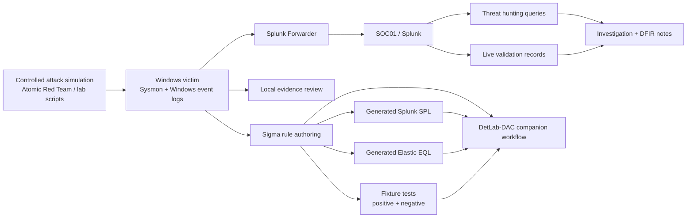

# cybersecurity-playbook

[](https://github.com/egrexsec/cybersecurity-playbook/actions/workflows/detection-validation.yml)

An **investigation-led technical portfolio** that reconstructs approved lab activity through evidence handling, forensic reasoning, timelines, and public-safe case documentation.

Detection engineering, purple-team validation, threat hunting, and automation remain first-class supporting capabilities: they create investigative leads, test hypotheses, and turn completed analysis into reusable Sigma rules, platform queries, fixtures, and validation evidence.

## Explore

- [Validated PowerShell Detection Lifecycle v1](detections/packs/validated-powershell-lifecycle-v1/README.md)
- [Investigation portfolio](investigations/README.md)
- [DFIR capability library](dfir/README.md)
- [Validation status](#current-validation-status)
- [What this repository is](#what-this-repository-is)
- [Investigation lifecycle](#investigation-lifecycle)
- [Detection lifecycle](#detection-lifecycle)
- [Repository map](#repository-map)
- [Quick-start validation](#quick-start-validation)
- [Current capabilities](#current-capabilities)
- [Current limitations](#current-limitations)
- [Case study](#case-study)
- [What this project demonstrates](#what-this-project-demonstrates)
- [Additional repository documentation](#additional-repository-documentation)

## Current validation status

| Scenario | ATT&CK technique | Behavior | Detection format | Validation status |
|---|---|---|---|---|
| PT-2026-001 | T1059.001 | PowerShell decode-and-execute | Sigma + Splunk/Wazuh evidence | **Live validated** |
| PT-2026-002 | T1059.003 | Windows command shell execution | Sigma + Splunk/Wazuh evidence | **Live validated** |
| PT-2026-003 | T1047 | WMI-backed process execution | Sigma + Splunk/Wazuh evidence | **Live validated** |
| PT-2026-004 | T1053.005 | Scheduled task creation | Sigma + Splunk evidence | **Live validated** |
| PT-2026-005 | T1543.003 | Windows service creation | Sigma + Splunk evidence | **Live validated** |
| PT-2026-006 | T1547.001 | Registry run key persistence | Sigma + Splunk evidence | **Live validated** |
| PT-2026-007 | T1037.001 | Logon script registry persistence | Sigma + Splunk evidence | **Live validated** |
| PT-2026-008 | T1197 | BITS job creation | Sigma + Splunk evidence | **Live validated** |
| PT-2026-009 | T1546.013 | PowerShell profile persistence | Sigma + Splunk evidence | **Live validated** |
| PT-2026-010 | T1218.011 | Rundll32 proxy execution | Sigma + Splunk evidence | **Live validated** |
| PT-2026-011 | T1218.010 | Regsvr32 proxy execution | Sigma + Splunk evidence | **Live validated** |
| PT-2026-012 | T1569.002 | Service-launched command execution | Sigma + Splunk evidence | **Live validated** |
| PT-2026-013 | T1546.003 | Permanent WMI event subscription creation | Sigma + Splunk evidence | **Live validated** |
| PT-2026-014 | T1105 | PowerShell web ingress transfer | Sigma + Splunk evidence | **Live validated** |
| PT-2026-015 | T1218.005 | Mshta child-process proxy execution | Sigma + Splunk + Defender evidence | **Live validated with prevention control** |

Detection Cycle 1 also added three completed threat hunts and a bounded benign campaign linking T1105 to T1218.005. Its Mayuri-era program documentation is preserved under [docs/history/mayuri](docs/history/mayuri/README.md).

**Meaning of statuses in this repo**
- **Live validated**: exercised against approved live lab activity with positive/negative evidence and cleanup confirmation. Historical Mayuri validation records retain this status even though the Mayuri environment was decommissioned in October 2026.
- **Verified**: exercised successfully against an approved dataset or bounded workflow with reviewable evidence, but not necessarily against a standing owned environment.
- **Fixture tested**: validated offline against sanitized positive/negative fixtures only.
- **Conversion supported**: Sigma successfully converts to a backend target, but no live backend validation exists yet.
- **Planned / partially ready**: documented or scaffolded, but not yet validated to the same standard.

## What this repository is

This repository is the **content and evidence companion** to **DetLab-DAC**.

- `cybersecurity-playbook` stores investigation methods and case records alongside reusable scenarios, Sigma rules, generated queries, fixtures, hunts, and validation records.
- **DetLab-DAC** is the companion platform/workflow that can consume, display, or operationalize this content.

This repository is **not** a standalone SIEM product, not a production detection deployment framework, and not a replacement for environment-specific engineering review.

Raw evidence, full forensic acquisitions, credentials, and sensitive infrastructure details remain private. Public artifacts are sanitized derivatives with enough provenance to review the method and reasoning. AI output is not evidence and must be independently validated against source artifacts.

AWS is now an active investigation domain in this portfolio. The Flaws2.cloud Defender track provides a verified CloudTrail/IAM investigation workflow using AWS CLI, PowerShell, jq, and a bounded public training dataset. This repository does not provision a standing AWS lab environment.

## Investigation lifecycle

The portfolio uses one canonical [21-step investigation lifecycle](docs/workflows/investigation-lifecycle.md), from scenario definition and environment preparation through triage, scoping, evidence acquisition, timeline reconstruction, endpoint/identity/network analysis, root cause, persistence, lateral movement, resource access, response recommendations, telemetry and detection lessons, sanitized reporting, and restoration. The [evidence-handling workflow](docs/workflows/evidence-handling.md) and expanded [investigation template](templates/investigation-template.md) support that lifecycle rather than defining alternatives.

Investigation and DFIR capabilities use **Planned**, **Installed**, **Verified**, and **Live validated** as maturity statuses. These do not replace Sigma-native rule lifecycle values or the existing detection validation statuses above.

## Detection lifecycle

The current implemented workflow is:

1. controlled adversary simulation on an approved lab endpoint
2. Windows and Sysmon telemetry collection
3. Splunk-based investigation and field review
4. Sigma rule development
5. Splunk and Elastic query generation
6. positive and negative fixture testing
7. live or dataset-backed validation in an approved environment
8. hunt, investigation, and validation record publication


```mermaid
flowchart LR
    A[Controlled attack simulation
Atomic Red Team / lab scripts] --> B[Windows victim
Sysmon + Windows event logs]
    B --> C[Splunk Forwarder]
    C --> D[SOC01 / Splunk]
    B --> E[Local evidence review]
    D --> F[Threat hunting queries]
    D --> G[Live validation records]
    B --> H[Sigma rule authoring]
    H --> I[Generated Splunk SPL]
    H --> J[Generated Elastic EQL]
    H --> K[Fixture tests
positive + negative]
    F --> L[Investigation + DFIR notes]
    G --> L
    H --> M[DetLab-DAC companion workflow]
    I --> M
    J --> M
    K --> M
```

## Repository map

| Path | Purpose | Content type | Validation model |
|---|---|---|---|
| `purple-team/scenarios/` | Canonical purple-team scenario definitions | Human-authored YAML + notes | Schema validation + linked live evidence |
| `detections/sigma/` | Canonical authored Sigma rules | Human-authored YAML | Sigma lint + conversion + fixtures + live validation where available |
| `detections/generated/` | Backend-specific generated output | Generated SPL/EQL | Regenerated from canonical Sigma; do not edit by hand |
| `detections/packs/` | Versioned portfolio-ready lifecycle manifests | Deterministic JSON + documentation | Source/artifact hashes + fixtures + CI staleness check |
| `detections/validation/live/` | Sanitized historical live-execution records | Generated JSON evidence | Parsed in repo validation; existing records were sourced from Mayuri lab runs before decommissioning |
| `detections/validation/` | Human-readable validation summaries | Human-authored Markdown | Linked to fixtures and live validation JSON |
| `tests/fixtures/` | Positive/negative rule fixtures | Sanitized JSON fixtures | Offline fixture test harness |
| `automation/` | Validation and orchestration tooling | Python + PowerShell | Repo-side command execution and content validation |
| `investigations/` | Domain-organized investigation records and indexes | Human-authored Markdown | Evidence-led review with sanitized source references |
| `dfir/` | Reusable acquisition, timeline, memory, and evidence-handling methods | Human-authored Markdown | Capability maturity: Planned / Installed / Verified / Live validated |
| `docs/workflows/` | Investigation and validation operating workflows | Human-authored Markdown | Documentation and completed-case review |
| `docs/current-state/` | Program status, readiness, timeline, portfolio metrics | Human-authored Markdown | Updated from repo/lab evidence |
| `docs/detection-engineering/` | Detection engineering implementation notes | Human-authored Markdown | Documentation-only |
| `docs/data-sources/` | Source-system and field-mapping notes | Human-authored Markdown | Documentation-only |
| `templates/` | Authoring templates for detections, hunts, investigations | Human-authored Markdown templates | Manual review + template consistency checks |
| `case-studies/` | End-to-end, skills-forward technical walk-throughs | Human-authored Markdown | Sourced from validated scenarios or verified bounded datasets |
| `learning-labs/` | Concise notes from CyberDefenders, TryHackMe, HTB, and other training sources | Human-authored Markdown | Learning value only; promote stronger work into case studies |
| `docs/history/mayuri/` | Historical Mayuri infrastructure and validation-program records | Human-authored Markdown | Historical provenance only; not current infrastructure state |

## Quick-start validation

These commands currently work from the repository root:

```bash
python3 playbook validate
python3 playbook --json sigma lint
python3 playbook --json sigma convert --target all
python3 playbook --json test fixtures
python3 playbook --json validate previous-scenarios
python3 playbook --json status
python3 playbook --json timeline
python3 playbook --json metrics
python3 automation/validators/check_markdown.py
```

## Current capabilities

Implemented today:
- investigation domain indexes and a reusable investigation lifecycle
- public-safe evidence-handling and case-documentation standards
- endpoint investigation records linked to live-validated Windows scenarios
- schema validation for scenarios and hunt hypotheses
- Sigma metadata linting
- Sigma conversion to Splunk and Elastic outputs
- positive and negative fixture testing
- sanitized live validation record parsing
- fifteen historically live-validated Windows scenarios across multiple execution, persistence, ingress-transfer, and proxy-execution techniques
- generated Splunk SPL and generated Elastic EQL separation
- GitHub Actions validation workflow
- secret scanning in CI
- public-safe evidence handling and sanitized repo artifacts
- normalization into the shared DetLab Detection Content Specification v1 with source-hash provenance

## Current limitations

Be explicit about current limits:
- Elastic conversion exists, but **no live Elastic backend is deployed or validated**
- Splunk live validation currently relies on **raw XML matching** in places where normalized fields/CIM remain incomplete
- durable Splunk saved searches / alerts are **not yet verified as deployed objects**
- historical live coverage is concentrated on **Windows endpoint behaviors**
- full forensic acquisition, timeline, identity, network, cloud, and memory capabilities remain **Planned** unless their indexes state otherwise
- AWS investigation capability is **Verified** through the Flaws2.cloud Defender workflow, but **no standing AWS environment is provisioned by this repository**
- raw evidence remains private, so public case material is necessarily a sanitized derivative
- this repository is **not** a production deployment platform

## Case study

Start with the published end-to-end PowerShell case study, then review the additive domain indexes:
- [PowerShell Encoded Command Case Study](case-studies/powershell-encoded-command/README.md)
- [Windows case studies](case-studies/windows/README.md)
- [Active Directory case studies](case-studies/active-directory/README.md)
- [AWS case studies](case-studies/aws/README.md)
- [Flaws2.cloud Defender case study](case-studies/aws/flaws2-defender/README.md)
- [Learning labs](learning-labs/README.md)

## What this project demonstrates

This repository demonstrates evidence-backed security engineering skills in:
- investigation scoping and hypothesis-driven analysis
- evidence handling, provenance, and public-safe reporting
- forensic acquisition and timeline methodology
- detection engineering
- purple-team validation
- threat hunting
- SIEM investigation
- ATT&CK mapping
- Python automation
- CI/CD for security content
- fixture-driven rule testing
- technical writing and evidence handling

## Additional repository documentation

- [Roadmap](ROADMAP.md)
- [Investigations](investigations/README.md)
- [DFIR capability library](dfir/README.md)
- [Contributing](CONTRIBUTING.md)
- [Security policy](SECURITY.md)
- [Current portfolio status](docs/current-state/PORTFOLIO_STATUS.md)
- [Capability matrix](docs/current-state/CAPABILITY_MATRIX.md)
- [Portfolio metrics](docs/current-state/PORTFOLIO_METRICS.md)
- [Mayuri historical archive](docs/history/mayuri/README.md)
- [Historical Mayuri program status](docs/history/mayuri/PURPLE_TEAM_PROGRAM_STATUS.md)
- [DetLab Detection Content Specification v1](docs/detection-content-spec-v1.md)
